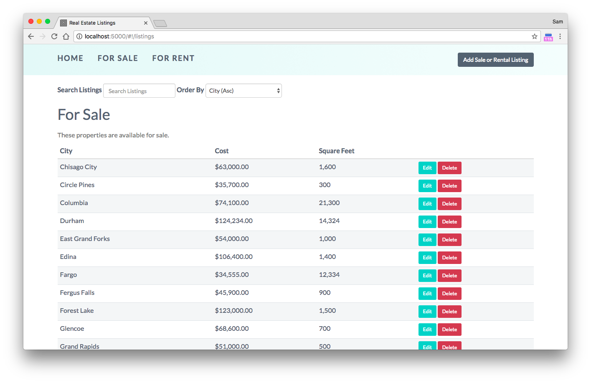

## Getting Started

These instructions will get you a copy of the project up and running on your local machine for development and testing purposes.


### Installing via Docker

Run dockerized application:

```
docker-compose up -d --build
```

You can visit http://localhost:8082  or http://135.125.106.207:8082 to see the application in action.

### Afterwards, execute the following command to check if the application and Mongo DB container are running.

```
docker-compose ps
```

### Import data:

```
docker-compose exec database mongoimport --host mongodb  --db realestate --collection rentals --file /dump/scripts/rentalData.js
docker-compose exec database mongoimport --host mongodb  --db realestate --collection listings --file /dump/scripts/listingData.js
```

 ### if you wish to see the logs and output for the application and/or MongoDB, run the following command:

# See logs for all services
```
docker-compose logs -f
```
# See logs for only the application service
```
docker-compose logs -f web
```

# See logs for only the MongoDB service
```
docker-compose logs -f database
```


## Built With

* [AngularJS](https://angularjs.org/) - The front-end framework used
* [Bootstrap](http://getbootstrap.com/) - CSS Framework
* [Node.js](https://nodejs.org/en/) - Used for server side JavaScript code
* [Express](https://expressjs.com/) - Node.js framework 
* [MongoDB](https://rometools.github.io/rome/) - Database
* [Heroku](https://rometools.github.io/rome/) - Used to deply the project



## Authors

* **janssen koubikani** - [Github](https://github.com/janssenkoubikani/)
